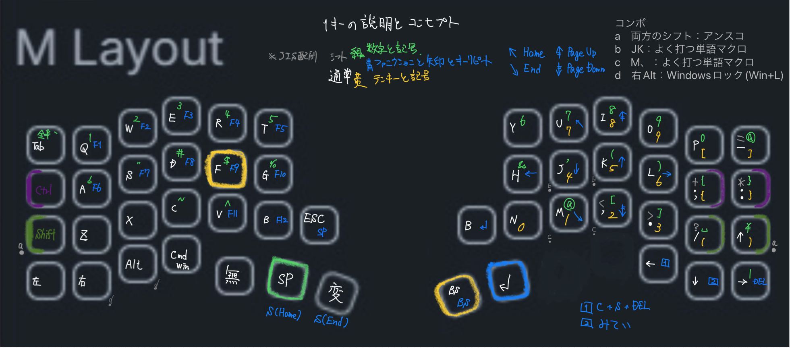
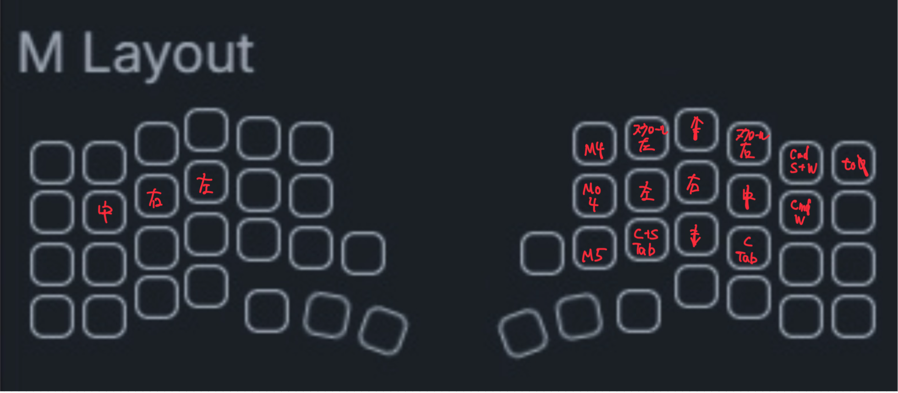

[torabo-tsuki LP](https://github.com/sekigon-gonnoc/torabo-tsuki-lp)用のZMKファームウェア

* _centralがついているuf2をトラックボールがついている方に、_peripheralを反対側に書き込んでください
* キーマップはkeymap-editorおよびzmk-studioで編集できます

# 自分のキーマップ

オートマウスレイヤー (layer: 1)

- mo4 スクロールレイヤー(黃レイヤー)